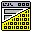

#  DFM Toolkit 
> The DFM Toolkit is a collection of tools to process DFM files produced by Embarcadero's RAD Studio.

The DFM Toolkit consists of
- DFM Image Export
  > A Tool that exports image data from a given DFM File
- DFM Formatter
  > A Tool to normalize the formatting of a DFM File
- DFM Find
  > A Tool to search for certain parameters, names or types in a DFM File
- libdfm
  > The core library to parse and process DFM files

Because of a lack of any sort of documentation or specification the syntax and semantic is mostly guessed based on examples found online. A DFM file is tokenized using the the automata described (here)[./etc/lexer.md] and the tokens are passed using the context-free grammar described [here](./etc/grammar.md).

## Goal

Goal of this projects is to provide Delphi developers easy to use tools to work with .dfm files in a way currently not or not easily possible with tools provided by Embarcadero.

This includes but is not limited to:
- Formatting .dfm files
- Extracting data from .dfm files (e.g. images, configurations)
- Search in .dfm files (e.g. for images, configurations, certain values/types)
- Editing .dfm files (e.g. removing attributes, replacing images)

## Compiling
**Note: Because of a dependency to the `::iconv()` function a build on/for Windows might not be easy** 

```bash
# Build Release
git clone https://github.com/Dadie/dfm-toolkit.git
cd dfm-toolkit
mkdir .build-release
cd .build-release
cmake .. -DCMAKE_BUILD_TYPE=Release
cmake --build .
```

```bash
# Build Debug
git clone https://github.com/Dadie/dfm-toolkit.git
cd dfm-toolkit
mkdir .build-debug
cd .build-debug
cmake .. -DCMAKE_BUILD_TYPE=Debug
cmake --build .
```
### Requirements/Dependencies

The DFM Toolkit requires a `C++` compiler supporting at least `C++20` e.g. `clang 11` and uses `CMake`.

While the `libdfm` as no further dependencies, the applications depend also on [`docopt.cpp`](https://github.com/docopt/docopt.cpp).

For the usage of each application in the toolkit see the `USAGE` string in the `$app.main.cpp` or call the application with the `--help` argument.

### Tests

This projects uses `ctest` for automated testing. Call `ctest --help` for more information in the `CMake` Build directory.

```bash
# Build Debug
git clone https://github.com/Dadie/dfm-toolkit.git
cd dfm-toolkit
mkdir .build-debug
cd .build-debug
cmake .. -DCMAKE_BUILD_TYPE=Debug
cmake --build .

# Run ctests
for proj in "../projects/"* 
do
  if [[ -d $proj ]]; then
    ctest --test-dir "projects/$(basename $proj)/"
  fi
done
```

## Note of caution

Tools are provided as is. APIs may (or rather will likely) change. Please either have backups of your .dfm files or use a CVS to make sure no data is lost.

## Contribution

Unless stated otherwise any contribution is assumed to be under the same license as the DFM Toolkit. Contributions are always welcome, aspecially obscure (but verified valid) examples of .dfm files.

## License

See [LICENSE](./LICENSE)
