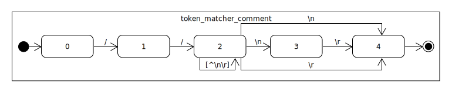
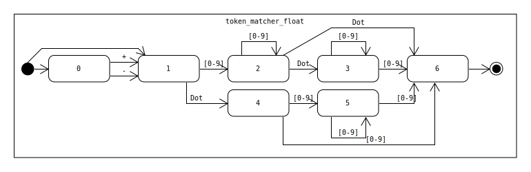
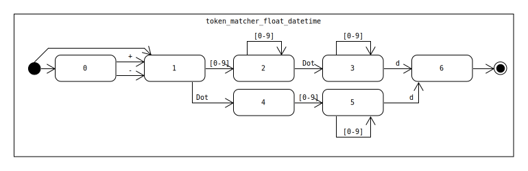
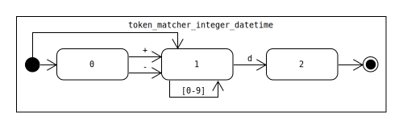
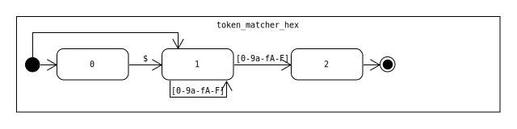
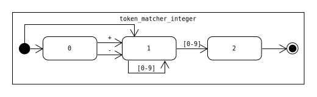
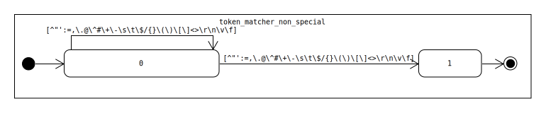
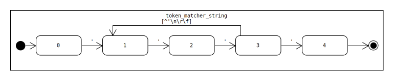
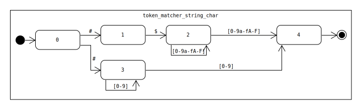
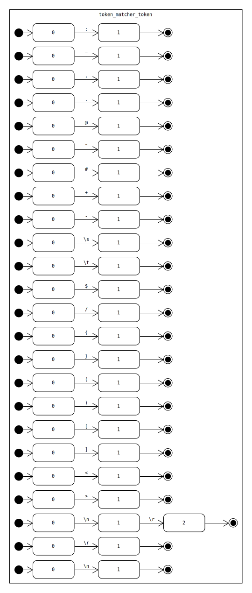

# DFM Lexer

A given DFM file's content is cut into tokens using the following NFA automata by seeking the longest match.

## **Comment Token**

## **Float Token**

## **Float Datetime Token**

## **Integer Datetime Token**

## **Hex Number Token**

## **Integer Token**

## **Word Token**

## **String Token**

## **String Character Token**

## **Special Character Token**

